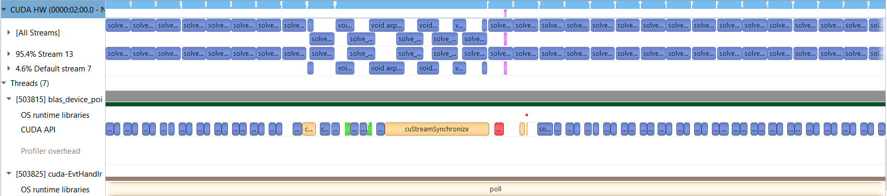

# openacc_heat_equation

## Задание
В данной работе нужно было реализовать уравнение теплопроводности в двумерной области на  равномерных сетках с начальной инициализацией в сетки в граничных точках.

Нужно было реализовать программу с использованием директив OpenACC, а часть подсчета ошибки реализовать с использованием библиотеки cuBLAS. 

## Ход работы

### <ins>Версия 1</ins>
Для подсчета ошибки **err** с помощью cuBLAS были использованы три функции: `cublas[SD]copy`, `cublas[SD]axpy` и `cublasI[sd]amax`, где `sd` - варианты функций для данных с одинарной точностью (`float`) или двойной (`double`) соответственно. В [наивном варианте](src/heat_equation_solver_blas_naive.cu) сначала копировались данные в промежуточный буффер **diff_buff** через `cublasCopy`, далее этот буффер использовался для сохранения результата `cublasAxpy`, и после в нем находился индекс максимального через `cublasIamax`, и далее элемент **diff_buff** с максимальным индексом копировался в **err** через `cublasCopy`.

Ниже приведен профиль наивной версии программы.

Профиль "Версии 1". Можно заметить, что для вычисления ошибки происходит лишнее копирование на девайс. Также можно предположить, что копирование индекса маскимальной ошибки <b>err_idx</b> с девайса на хост также лишнее действие

По профилю можно сказать, что вычисление ошибки происходит в параллельном стриме относительно обновлений сетки, поэтому GPU всегда нагружен.

### <ins>Версия 2</ins>

Во второй версии [программы](src/heat_equation_solver_blas_without_err_copy.cu) было устранено лишнее копирование **err** на девайс, что ускорило программу.

Профиль "Версии 2"

### <ins>Версия 3</ins>

Появилась идея включить у cuBLAS режим device-указателей - все константы по типу **a** в `cublasAxpy` должны быть не с хоста, а с девайса. Было предположнение, что это должно ускорить программу из-за отсутствия копирования между хостом и девайсом. Например, для вычисления максимальной ошибки **err** нужно было копировать индекс максимальной ошибки **err_idx** на хост. Ниже приведен профиль [программы](src/heat_equation_solver_blas_device_pointer_mode.cu).

Профиль программы "Версия 3"

## Бенчмарки
По результатам замеров лучшую скорость показал вариант с чистыми OpenACC инструкциями без использования cuBLAS

Бенчмарки разных версий программ на GPU

Бенчмарки разных версий программ на CPU

